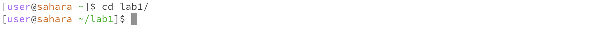
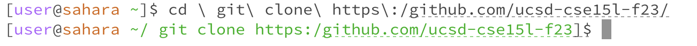
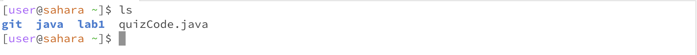
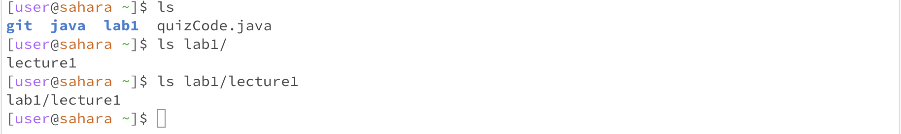
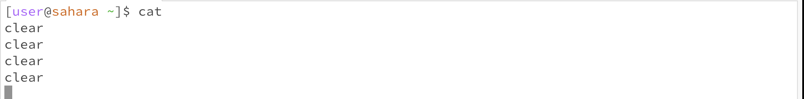
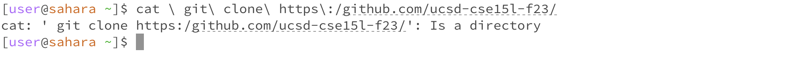
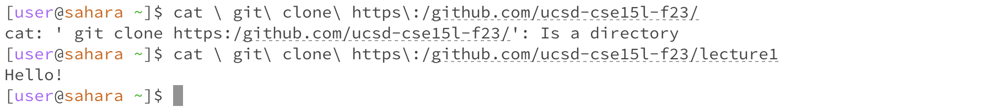

# Lab Report 1 - Basic Filesystem Commands
## Introduction 

In this lab, I will demonstrate three fundamental filesystem commands: 'cd', 'ls', and 'cat'. These commands are the building blocks of navigating and interacting with files and directories. 

---

## 'cd' - Change Directory 

- Example 1: Using 'cd' with no argument
  
 

When the command is used without an argument, it doesn't output anything. It returns the user to the home directory. 

- Example 2: Using 'cd' with a path to a directory as an argument

 

Now that the command is used with a directory name as an argument, it has changed the working directory to the specified directory (/ git clone https:/github.com/ucsd-cse151f2315).

- Example 3: Using 'cd' with a path to a file as an argument

 

After using the command, the output showed an error because 'cd' only works with directories. When the command is used with a file as an argument, it attempts to find a directory with the same name as the file. That's why it resulted in an error.

## 'ls' - List 

- Example 1: Using 'ls' with no argument

When using the command without arguments, it lists the directories and files in the current working directory.

- Example 2: Using 'ls' with a path to a directory as an argument

Now that we have used the command with an argument ('lab1'), it lists all the files and directories in the current directory.

- Example 3: Using 'ls' with a path to a file as an argument

After using the command, the resulting output showed an error because 'ls' can't be used with a file as an argument; it only works with directories. Additionally, the file doesn't contain any content, so there was nothing to output.

## 'cat' - Concatenate

- Example 1: Using 'cat' with no argument

When using the cat command without an argument, it appears as if it doesn't output anything. However, in this command, 'cat' waits for input from the input. Anything you type will be echoed back to the standard output once you hit enter.

As seen in the picture:

This behavior continues until you send an end-of-file signal (Ctrl+D) to exit. The primary function of 'cat' is to concatenate and display the content of one or more files. It's a versatile command that can be used to read, create, and manipulate files. When you use 'cat' followed by a file name, it displays the contents of that file in the terminal. So, when you run 'cat' with no arguments, it's actually reading from standard input and writing to standard output.

- Example 2: Using 'cat' with a path to a directory as an argument

Now that we used a directory as an argument, it resulted in an error because the 'cat' command can't be used with a directory as an argument. What it does is attempt to concatenate and display the content of files. However, since the argument was a directory with multiple paths, it resulted in an error. 

- Example 3: Using 'cat' with a path to a file as an argument

After using the command with a path to a file as an argument, it displayed the content of the file in the terminal 
