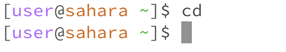

# Lab Report 1 - Basic Filesystem Commands
## Introduction 

In this lab, I will demonstrate three fundamental filesystem commands: 'cd', 'ls', and 'cat'. These commands are the building blocks of navigating and interacting with files and directories. 

---

## cd - Change Directory 

Example 1: Using 'cd' with no argument 
 

When 'cd' is used without an argument, it doesn't output anything. It returns the user to the home directory. 

Example 2: Using 'cd' with a path to a directory as an argument 

ls

cat
