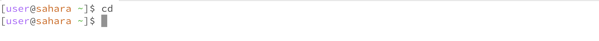
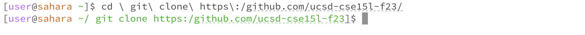
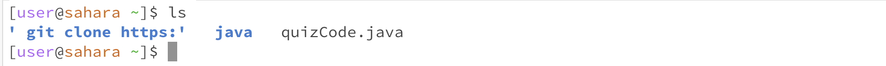
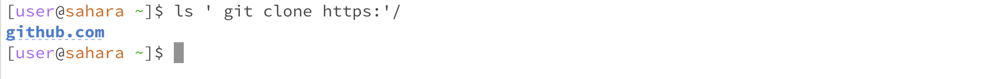
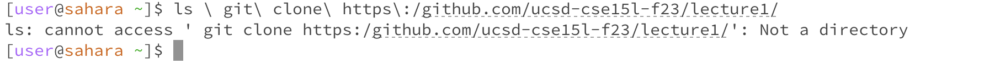

# Lab Report 1 - Basic Filesystem Commands
## Introduction 

In this lab, I will demonstrate three fundamental filesystem commands: 'cd', 'ls', and 'cat'. These commands are the building blocks of navigating and interacting with files and directories. 

---

## cd - Change Directory 

- Example 1: Using 'cd' with no argument
  
 

When the command is used without an argument, it doesn't output anything. It returns the user to the home directory. 

- Example 2: Using 'cd' with a path to a directory as an argument

 

Now that the command is used with a directory name as an argument, it has changed the working directory to the specified directory (/ git clone https:/github.com/ucsd-cse151f2315).

- Example 3: Using 'cd' with a path to a file as an argument

 

After using the command, the output showed an error because 'cd' only works with directories. When the command is used with a file as an argument, it attempts to find a directory with the same name as the file. That's why it resulted in an error.

## ls - List 

- Example 1: Using 'ls' with no argument

When using the command without arguments, it lists the directories and files in the current working directory.

- Example 2: Using 'ls' with a path to a directory as an argument

Now that we have used the command with an argument ('git clone https:/'), it lists all the files and directories that are in that directory.

- Example 3: Using 'ls' with a path to a file as an argument

After using the command, the resulting output showed an error because 'ls' can't be used with a file as an argument; it only works with directories. Additionally, the file doesn't contain any content, so there was nothing for it to output.

## cat - Concatenate

- Example 1: Using 'cat' with no argument
- Example 2: Using 'cat' with a path to a directory as an argument
- Example 3: Using 'cat' with a path to a file as an argument
