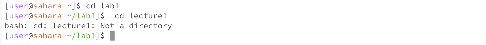

# Lab Report 1 - Basic Filesystem Commands
## Introduction 

In this lab, I will demonstrate three fundamental filesystem commands: `cd`, `ls`, and `cat`. These commands are the building blocks of navigating and interacting with files and directories. 

---

## `cd` - Change Directory 

- Example 1: Using `cd` with no argument
  
 

When the `cd` command is used without any arguments, there's no output displayed in the terminal. This command directs the user to their home directory. Before executing the `cd` command, the current working directory is indicated by the `~` symbol in the terminal prompt `[user@sahara ~]$`. After the command is executed, the user remains in the same location, which is their home directory, as the default behavior of the `cd` command without arguments is to navigate to the user's home directory.

- Example 2: Using `cd` with a path to a directory as an argument

 

Now that `cd` command is used with a directory name `lab1/` as the argument, it changed the current working directory to `lab1/`. This is evident from the updated prompt, which now displays `[user@sahara ~ /lab1]$`. 

- Example 3: Using `cd` with a path to a file as an argument

 

After attempting the `cd` command, the output was an error. This is because the `cd` command is used to change directories, and it expects its argument to be a directory. In this case, the command was given `lecture1` as an argument. Since `lecture1` is not a directory but rather a file or non-existent entity in the current directory, therefore,  it resulted with the error `Not a directory`.

## `ls` - List 

- Example 1: Using `ls` with no argument

When using `ls` command without an argument, it displays the contents of the current working directory. In this case, the output shows three directories (`git`, `java`, and `lab1`) and one file (`quizCode.java`). This provides a quick overview of the items present in the current directory.

- Example 2: Using `ls` with a path to a directory as an argument

Now that we used `ls` command with (`lab1`) as its argument, the command displays the contents of the `lab1` directory from the current location. Which, there's one directory named `lecture1` inside `lab1`.

- Example 3: Using `ls` with a path to a file as an argument

After using `ls` command, the reulting output displayed the directory structure within `lab1`. The reason we see the contents of the `lab1` directory is because the `ls` command is specifically designed to `list` the contents of directories. In this instance, the `lab1` directory contains a subdirectory named `lecture1`. By using the `ls` command with the correct directory path, we were able to successfully view its contents."

## `cat` - Concatenate

- Example 1: Using `cat` with no argument

When using `cat` command without an argument, it appears as if it doesn't output anything. However, in this command, `cat` waits for input from the input. Anything you type will be echoed back to the standard output once you hit enter.

As seen in the picture:

This will continue until you send an end-of-file signal (`Ctrl+D`) to exit. The primary function of `cat` is to concatenate and display the content of one or more files. It's a versatile command that can be used to read, create, and manipulate files. When you use `cat` followed by a file name, it displays the contents of that file in the terminal. So, when you run `cat` with no arguments, it's actually reads from the standard input and writing to standard output.

- Example 2: Using `cat` with a path to a directory as an argument

Now that we used `cat` command with a directory (`lab/`) as an argument, it resulted in an error because the `cat` command can't be used with a directory as an argument. What it does is attempt to concatenate and display the content of files. However, since the argument was a directory with multiple paths, it resulted in an error. 

- Example 3: Using `cat` with a path to a file as an argument

When using `cat` command with `lab1/` as the argument, it returned an error stating that `lab1/` is a directory. However, when `cat` was used with `lab1/lecture1` as the argument, the contents of the `lecture1` file were successfully displayed, showing the message `Hello there!` in the file. 
