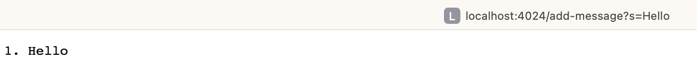
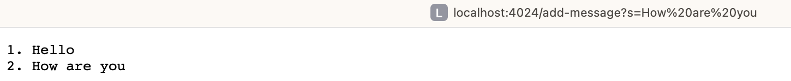
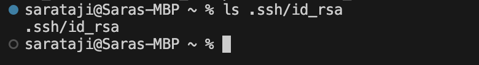
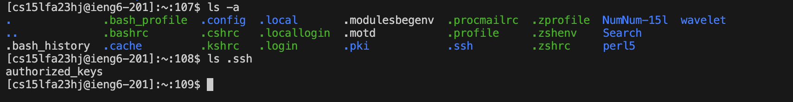
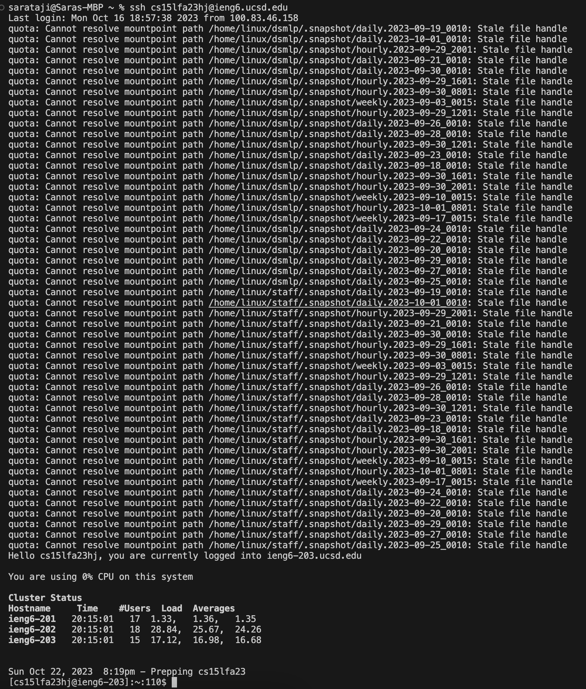

# Lab Report 2 - Servers and SSH Keys
## Part 1: Implementing `StringServer`

I created a web server named `StringServer` that handles requests to append messages to an ongoing string.

## Code `StringServer.java`:
```java
import java.io.IOException;
import java.net.URI;

class Handler implements URLHandler {
    
    String state = "";
    int currentIdx = 0;

    public String handleRequest(URI url) {
        if (url.getPath().equals("/")) {
            return state;
        } 
        else {
            if (url.getPath().contains("/add-message")) {
                String[] parameters = url.getQuery().split("=");
                if (parameters[0].equals("s")) {
                    currentIdx++;
                    if (currentIdx != 1)
                        state += "\n" + currentIdx + ". " + parameters[1];
                    else
                        state += currentIdx + ". " + parameters[1];
                    return state;
                }
            }
            return "404 Not Found!";
        }
    }
}

class StringServer {
    public static void main(String[] args) throws IOException {
        if(args.length == 0){
            System.out.println("Missing port number! Try any number between 1024 to 49151");
            return;
        }

        int port = Integer.parseInt(args[0]);

        Server.start(port, new Handler());
    }
}
```
The `Server.java` file is in the `Server` class, which utilizes Java's built-in `HttpServer`. A custom handler, `ServerHttpHandler,` is defined to manage the requests and delegate them to the `Handler`.

## Code `Server.java`: 
```java
// A simple web server using Java's built-in HttpServer

// Examples from https://dzone.com/articles/simple-http-server-in-java were useful references
import java.io.IOException;
import java.io.OutputStream;
import java.net.InetSocketAddress;
import java.net.URI;

import com.sun.net.httpserver.HttpExchange;
import com.sun.net.httpserver.HttpHandler;
import com.sun.net.httpserver.HttpServer;

interface URLHandler {
    String handleRequest(URI url);
}

class ServerHttpHandler implements HttpHandler {
    URLHandler handler;
    ServerHttpHandler(URLHandler handler) {
      this.handler = handler;
    }
    public void handle(final HttpExchange exchange) throws IOException {
        // form return body after being handled by program
        try {
            String ret = handler.handleRequest(exchange.getRequestURI());
            // form the return string and write it on the browser
            exchange.sendResponseHeaders(200, ret.getBytes().length);
            OutputStream os = exchange.getResponseBody();
            os.write(ret.getBytes());
            os.close();
        } catch(Exception e) {
            String response = e.toString();
            exchange.sendResponseHeaders(500, response.getBytes().length);
            OutputStream os = exchange.getResponseBody();
            os.write(response.getBytes());
            os.close();
        }
    }
}

public class Server {
    public static void start(int port, URLHandler handler) throws IOException {
        HttpServer server = HttpServer.create(new InetSocketAddress(port), 0);

        //create request entrypoint
        server.createContext("/", new ServerHttpHandler(handler));

        //start the server
        server.start();
        System.out.println("Server Started!");
    }
}
```
Compiling: 

To compile both of the codes, we first need to change to the directory that contains both `Server.java` and `StringServer.java`

Then, we run it by using the following commands: 


The Number `4024` is my port number, which I've chosen to run the server on.

__Screenshot of add-message "Hello":__
 
1) which methods in your code are called?
   - The `handleRequest` method from the `Handler` class was called to process the request and generate the response based on the URL path and parameters.
   - The `handle` method from the `ServerHttpHandler` class was also accessed, which served as a bridge, taking in the `HTTP` request and guiding it to the correct `handler `method.

2) What are the relevant arguments to those methods and the values of any relevant class fields?
   - When processing the request, the method looks at the `url`, which in this case, receives the value `/add-message?s=Hello`. As the method processes the `url`, it changes the `state` of the class. Initially, `state` might be an empty string, but after processing the `/add-message?s=Hello` request, the `state` updates to contain the string `"1. Hello"`. In this context, the relevant argument to my method is the `url` with its specific value, and the class field that gets updated is `state`.

3) How do the values of any relevant fields of the class change from this specific request? If no values got changed, explain why.
   - When accessing the `/add-message?s=Hello` endpoint, the initial value of the `state` field is an empty string, and the `currentIdx` starts at `0`. After processing the request, the `state` field changes to `"1. Hello"` and the `currentIdx` increments to `1`. If a request doesn't change these values, such as a different request path or missing parameter, the fields would remain unchanged because the conditions to modify them in the `handleRequest` method wouldn't be met.

__Screenshot of add-message "How are you":__
 
1) Which methods in your code are called?
   - the `handle` method from `ServerHttpHandler` class is called to process the `HTTP` request.
   - The method calls the `handleRequest` method in the `Handler` class to determine the URL path and parameter.

2) What are the relevant arguments to those methods, and the values of any relevant fields of the class?
   - When the `handle` method in `ServerHttpHandler` is called, it uses the `exchange` argument to get details of the web request, including the message `/add-message?s=How are you`. Next, in the `handleRequest` method of the `Handler` class, the `url` argument holds this message. By this time, if this is our second message after `"Hello"`, the system would already have `"1. Hello"` stored in the `state` and would have noted that we've added one message before with the `currentIdx` set to `1`.
   
3) How do the values of any relevant fields of the class change from this specific request? If no values got changed, explain why.
   - After getting the `/add-message?s=How are you` requested, the program makes two main changes. It first updates the message count by adding one to `currentIdx`, changing its value from `1` to `2`. Then, it adds the new message `"How are you"` to the state, making it read `"1. Hello\n2` `"2. How are you"`. This means our old message `"Hello"` is followed by a new line and then our new message `"How are you"`


## Part 2: Command line using `ls` (SSH Key Handling)
- The path to the private key for SSH key for logging into `ieng6` (on computer or on the home directory of the lab computer)
  
- The path to the public key for SSH key for logging into `ieng6` (within your account on `ieng6`)
  
- The terminal interaction logged into `ieng6` with a course-specific account without being asked for a password.
 

## Part 3: Reflection 
During the 2nd and 3rd weeks of the lab, I acquired several technical skills that I wasn't familiar with before, such as:

- Setting up and using `SSH keys`, which removed the constant need for entering a password every time I accessed `ieng6`.
- Utilizing the `SCP command` to quickly transfer files between my computer and `ieng6`.
- Build and run basic `Java web servers` and manage web requests with the `URIHandler` class.
- Implementing the `curl` command to test URLs without opening them in a browser.
- Familiarize myself with terminal commands, like `scp` for shifting files and `mkdir` for creating new directories.


