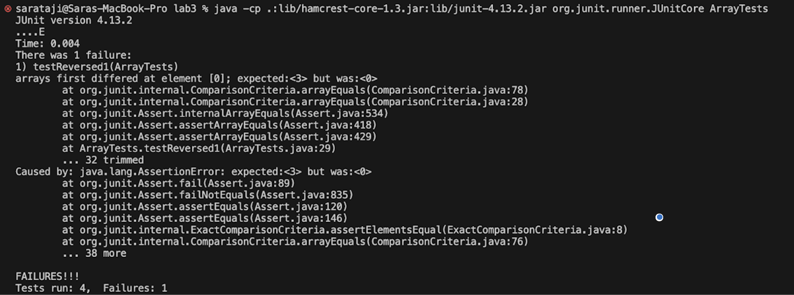

# Lab Report 3 - Bugs and Commands 

## Part 1 - Bugs 
In the `ArrayExamples` class, a bug was found within the `reversed` method. This method is supposed to return a new array with the elements reversed. However, due to a mistake in the loop's logic, it produces an error as a result. The error was revealed by our JUnit test suite. When the JUnit is run its output pinpoints the location of the bug and demonstrates its effect.

**Failure-Inducing Input**: 

- The JUnit test method, `testReversed1()`, will show the defects within the `reversed` method in the `ArrayExamples`class:

```
@Test
public void testReversed1()
{
  int[] arr = {1, 2, 3};
  int[] expected = ArrayExamples.reversed(arr);
  assertArrayEquals(new int[]{3, 2, 1}, expected);
}
```
- This test should pass if the `reversed` method functions correctly, but it fails with the current implementation. 

**Non-Failure-Inducing Input**: 

- The test method `testReversed()` demonstrates where the `reversed` method does not cause a failure dealing with an empty array:
```
@Test
public void testReversed()
{
  int[] input1 = {};
  assertArrayEquals(new int[]{}, ArrayExamples.reversed(input1));
}

```
- This test passes because reversing an empty array does not change it.

**The symptom, as the output of running the tests** 



- When running the tests with the bug, it showed an error in testReversed1() because the assertion failed. The test expected the reversed array to have `{3}` as its first element but instead got an empty array `{}`. This indicates that the `reversed` method in the ArrayExamples class is not functioning as intended when reversing an array with multiple elements.

**Orginal Code:**

```
static int[] reversed(int[] arr)
{
    int[] newArray = new int[arr.length];
    for(int i = 0; i < arr.length; i += 1)
    {
        arr[i] = newArray[arr.length - i - 1];
    }
    return arr;
}
```
- The method is attempting to overwrite the elements of the input array `arr` instead of using a separate array `newArray` to store the reversed elements.

**After:** 

```
static int[] reversed(int[] arr)
{
  int[] newArray = new int[arr.length];
  for(int i = 0; i < arr.length; i++)
    {
        newArray[i] = arr[arr.length - i - 1];
    }
    return newArray;
}
```
- Now, the method uses `newArray` to hold the reversed values, ensuring that the original array `arr` is not altered and the correct reversed array is returned.

**Why the fix addresses the issue**

- The original `reversed` method incorrectly attempted to assign the reversed values to the `arr` (the input array) itself when it should have been assigned to `newArray` (the array meant to hold the reversed values). Additionally, it returned the original array `arr`, which was not modified.
The fix corrects these issues by correctly assigning the reversed values to `newArray` and then returning `newArray`. This ensures that the method returns a new array with the elements of the input array in reversed order, as intended.


## Part 2 - Researching Commands
I've chosen `grep` command for my research, Which searches for specific patterns within files. 

1. **Recursive Search with `-r`**

We can use `-r` option to recursively search all text files within the current directory and it's subdirectories. The `-r` option is useful for searching through a large number of files and directories when you are not sure where the content might be.

 - Example  1: Searching for the string "Los Angeles" in all files recursively from the current directory
   
   > This command will list all instances of "Los Angeles" in the files of the current directory and its subdirectories.
   
    *Input*
  
    ```console
     grep -r "Los Angeles"
    ```

    *Output*
  
    ```console
   ./technical/government/About_LSC/Special_report_to_congress.txt:Foundation of Los Angeles, Legal Assistance Foundation of Chicago,
    ./technical/government/About_LSC/commission_report.txt:Bruce Iwasaki, Legal Aid Foundation of Los Angeles).
    ./technical/government/About_LSC/commission_report.txt:of Los Angeles). Notices to opposing counsel and the court or
    ./technical/government/About_LSC/commission_report.txt:Foundation of Los Angeles).
    ./technical/government/About_LSC/commission_report.txt:(testimony of Bruce Iwasaki, Legal Aid Foundation of Los Angeles).
    ./technical/government/About_LSC/commission_report.txt:Legal Aid Foundation of Los Angeles). The rule would also create
    ./technical/government/About_LSC/commission_report.txt:Foundation of Los Angeles).
    ./technical/government/About_LSC/State_Planning_Report.txt:The Los Angeles Basin. As a result of the merger between the
    ./technical/government/About_LSC/State_Planning_Report.txt:Los Angeles, there are now three programs serving this region. The
    ```

- Example  2: Searching within the `./technical/government` directory for the string "executive guide"

    *Input*
  
    ```console
      grep -r "executive guide" ./technical/government
    ```
  
    *Output*
  
    ```console
    ./technical/government/Gen_Account_Office/d0269g.txt:This executive guide is intended to identify effective practices
    ./technical/government/Gen_Account_Office/d0269g.txt:This executive guide was prepared under the direction of Linda
    ./technical/government/Gen_Account_Office/d0269g.txt:In this executive guide, we highlight many of the strategic
    ./technical/government/Gen_Account_Office/d0269g.txt:6this executive guide focuses on internal controls as
    ./technical/government/Gen_Account_Office/d0269g.txt:draft of this executive guide to obtain comments from interested
    ./technical/government/Gen_Account_Office/Testimony_cg00010t.txt:in GAO's executive guides have been incorporated into policy
    ```
Source: `man grep`


2. **Counting Matches with `-c`**

We can use `-c` to count the number of lines that match a pattern within files. The `-c` option quickly provides the frequency of a term, which is particularly useful in scenarios like searching for how often a function is called in a codebase.

- Example  1: Counting occurrences of the word "law" in a specific file
  
  > Here, grep counts how many times "law" appears in the specified text file.
  
  *Input*

  ```console
    grep -c "law" technical/government/Media/Do-it-yourself_divorce.txt
  ```

  *Output*

  ```console
   4
  ```
- Example 2: Counting occurrences of "aid" in another specific file

  *Input*

  ```console
    grep -c "aid" technical/government/Media/Legal-aid_chief.txt 
  ```
  
  *Output*

  ```console
    11
  ```

Source: `man grep`

  
3. **Context Control with -n**

We can use `-n` to display the line numbers in the file before the text where a match is found when using the grep command. This is particularly useful for identifying the exact location of the text within files, which is essential when analyzing logs, code, or any structured text files.

- Example 1:  Finding occurrences of "cells" and displaying their line numbers in the file `rr171.txt`
  
  > With `-n`, you can see the line numbers containing "cells" in `rr171.txt`, which is useful for direct referencing.

    *Input*
  
    ```console
      grep -n "cells" ./technical/biomed/rr171.txt*
    ```

    *Output*
  
    ```console
    16:        inflammatory reaction. These cells are rapidly recruited to
    21:        Neutrophils are relatively short-lived cells removed
    42:        their location within the tissue, these cells are likely to
    48:        lung neutrophils. Moreover, these cells exhibited decreased
    53:        factor activity in the cells. These findings suggest a
    103:          microscopy, we demonstrated that cells recovered using
    106:          Giemsa staining of cytospin samples showed that the cells
    131:          5cells/well). Cells were collected, washed and
    ``` 
The additional `-H` option, in combination with `-n`, tells `grep` to display the filename for each match in addition to the line number and the content of the matched line. This is particularly helpful when searching multiple files to ensure the output includes the source of each match. 

- Example 2: Using `-nH` to find "ecosystems" and display the line numbers along with the file names

    *Input*
  
    ```console
      grep -nH "ecosystems" ./technical/government/Env_Prot_Agen/bill.txt 
    ```
    
    *Output*
  
    ```console
      ./technical/government/Env_Prot_Agen/bill.txt:6456:ecosystems to atmospheric deposition.
      ./technical/government/Env_Prot_Agen/bill.txt:6505:status of terrestrial and aquatic ecosystems (including
    ```
Source: `man grep`


4. **Listing files with `-l`**

We can use the `-l` option with the `grep` command to output only the names of files with lines matching the search pattern instead of the usual output. This is useful when you simply want to identify files that contain a given pattern, which can be particularly useful in scenarios where you're interested in the presence of a string rather than its context. (According to `man grep`)

- Example  1: Locating files that contain the term "encryption" within the `./technical/government` directory
  
  > This command lists file names in the `./technical/government/` directory that contain the word "encryption", ignoring any errors caused by directories.
  
    *Input*
  
    ```console
      grep -l "encryption" ./technical/government/*
    ```
  
    *Output*
  
    ```console
      grep: ./technical/government/About_LSC: Is a directory
      grep: ./technical/government/Alcohol_Problems: Is a directory
  ```
- Example 2: Searching for files that contain the word "emergency" within the `./technical/911report/ directory`

  *Input*

  ```console
   grep -l "emergency" ./technical/911report/*.txt
  ```
  
  *Output*

  ```console
    ./technical/911report/chapter-1.txt
    ./technical/911report/chapter-10.txt
    ./technical/911report/chapter-12.txt
    ./technical/911report/chapter-13.2.txt
  ```

Source: `man grep`

  
  
