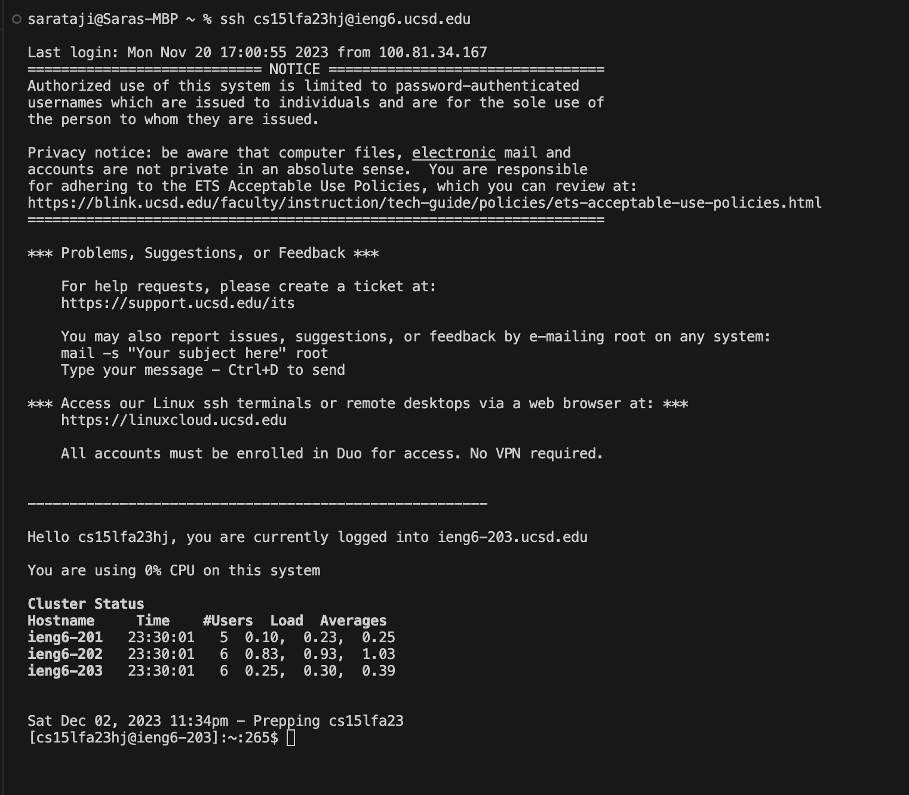
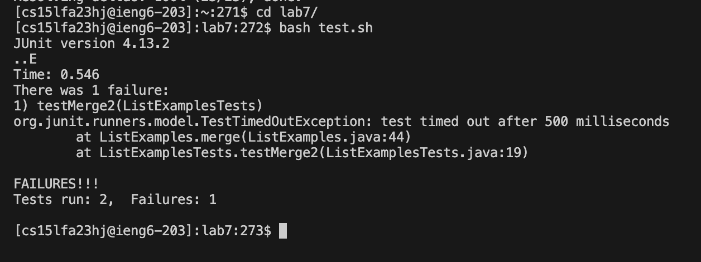
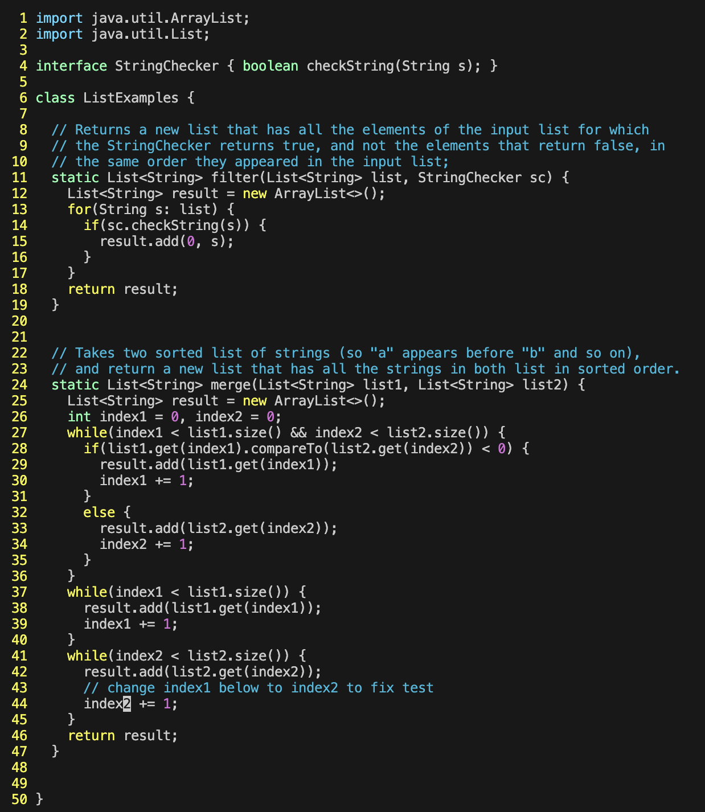
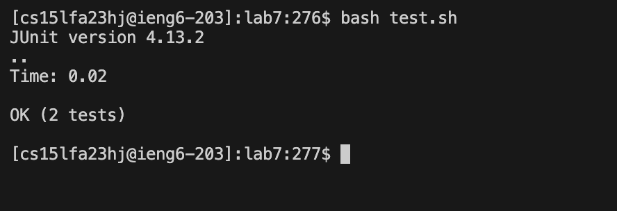
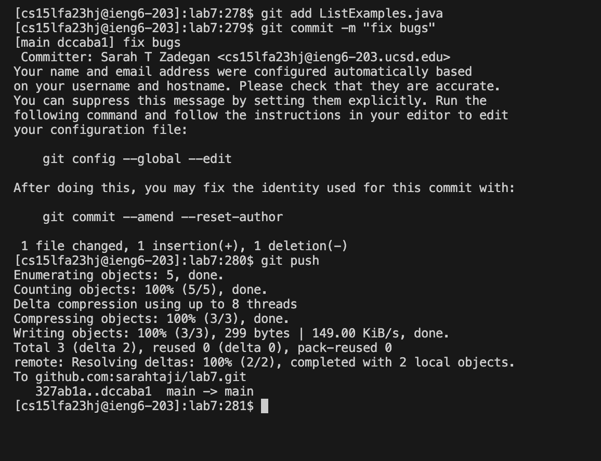
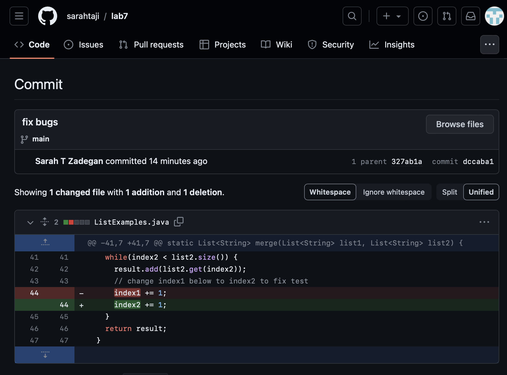

# Lab Report 4 - Vim (Week 7)

## 4. Log into ieng6



*Keys pressed:* `Ctrl-C`, `Ctrl-V` and `<enter>`

> To securely connect to my remote server, I first located the SSH command ```ssh cs15lfa23hj@ieng6.ucsd.edu```. I highlighted this phrase and copied it using ```Ctrl-C```. I then pasted the command using Ctrl-V into my terminal. To initiate the connection, I pressed ```<enter>```. This action executed the ```SSH``` command, establishing a secure link with my remote server and enabling me to log in.

## 5. Clone your fork of the repository from your GitHub account (using the SSH URL)


*Keys pressed:* `Clear`, `Ctrl-C`, type `git clone`, `Ctrl-V`, and `<enter>`.

> `Clear` command to empty my terminal then Copy the SSH URL `git@github.com:sarahtaji/lab7.git` of the *lab7* repository from my GitHub account by pressing `Ctrl-C` after highlighting the URL. Then, clone the repository into ieng6 by using the command `git clone`. Press `Ctrl-V` to paste the SSH URL just copied, and press `<Enter>` to execute the command. The `git clone` command is used to create a copy of an existing repository into a new directory on your local machine.

## 6. Run the tests, demonstrating that they fail


*Keys pressed:* Type `cd lab7` and press `<enter>` Then type `"bash te"`, press `<tab>` and `<enter>`.

> Changed the working directory to the `/lab7` directory. Then, execute the bash scripts in `test.sh` by using the `bash` command. To speed up the process, press `<tab>` after typing `"bash te"` in the terminal. This will autocomplete the command with the existing filename inside the `/lab7` directory.

## 7. Edit the code file to fix the failing test


*Keys pressed:* `vim ListExamples.java`, `<esc>`, `:set number`, `/index1 <enter>` , pressed `n` 4 times, `<i>` `<backspace>` type `2`, `<esc>`, `:wq` 

> `vim ListExamples.java` - opens the file in vim test editor. `:set number` - sets the number in the file. `/index1` - begin a search for the string `index1`. In Vim, I addressed a code error in `ListExamples.java`. First, I opened the file with `vim ListExamples.java` and enabled line numbering using `:set number` to navigate the file easily. Knowing the error was the use of `index1` instead of `index2` in the final merge loop, I used `/index1` to search for this term. I then pressed `n` four times to navigate to the specific occurrence at `line 44`. After making the necessary corrections, I exited insert mode with `<esc>` and saved and exited `Vim` with `:wq`.

 
## 8. Run the tests, demonstrating that they now succeed


*Keys pressed:* type `"bash te"`, press `<tab>` and `<enter>`.

> Ran the bash scrips in `test.sh` again by using `bash` command to run the tests. Then press `<tab>` after finishing typing `"bash te"` in the terminal to speed up the process by overwriting the existing filename inside the  `/lab7` directory. It succeeds now.


## 9. Commit and push the resulting change to your GitHub account


Keys pressed: type `git add ListExamples.java` and press `<enter>`. Then, type `git commit -m "fix bugs"` and press `<enter>`. After that, type `git push` and press `<enter>`

> I followed a specific sequence of commands. First, I typed `git add ListExamples.java` and pressed `<enter>` to stage the file `ListExamples.java` for the next commit. This step prepares the file with my recent edits to be included in the version history. Next, I executed `git commit -m "fix bugs"` and pressed `<enter>`. This command created a local commit with the message `"fix bugs,"` capturing the essence of the changes made. Finally, I concluded the process by typing `git push` and pressing `<enter>`, which uploaded all the new commits to my remote GitHub repository, ensuring that my online codebase reflects these latest fixes."

- Here's the result after the listExamples.java file gets pushed to my GitHub account from the web browser.
  

