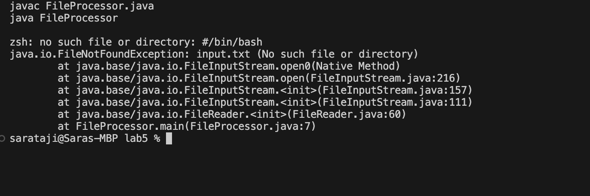

# Lab Report 5 - Putting it All Together
## Part1 - Debugging Scenario

## Original Post: 
Hello everyone,

I'm working on a Java program (`FileProcessor.java`) that's supposed to read a text file (`input.txt`) and print each line after performing some string manipulation. However, instead of processing each line, it's just repeatedly printing the first line with the manipulation. 

I think the bug might be in the way I'm reading the lines from the file, but I'm not entirely sure. I'm using a `BufferedReader` in a while loop. Here’s a screenshot of the output I’m getting on the terminal:
```java
import java.io.BufferedReader;
import java.io.FileReader;
import java.io.IOException;

public class FileProcessor {
    public static void main(String[] args) {
        try (BufferedReader reader = new BufferedReader(new FileReader("input.txt"))) {
            String line;
            while ((line = reader.readLine()) != null) {
                // Bug: The loop is not updating 'line' correctly
                System.out.println("Processing: " + line);
                // String manipulation (for example, reversing the line)
                System.out.println(new StringBuilder(line).reverse().toString());
            }
        } catch (IOException e) {
            e.printStackTrace();
        }
    }
}
```
## Terminal: 

I'm running the program with a Bash script (`runFileProcessor.sh`). Any suggestions on what might be causing this?

## TA Response Post: 

It seems like the issue might be related to how the file reading loop is set up in your Java program. Can you try adding some debug print statements inside the loop to print out the line just after it's read, before any manipulation? This will help us understand if the issue is with the file reading or the manipulation part. Run the program again with these debug statements and share the output.

## Outcome of code: 
I figured out the problem! The issue was in the `while` loop of my file reading logic. Here’s the information about the setup and the bug:

```java
import java.io.BufferedReader;
import java.io.FileReader;
import java.io.IOException;

public class FileProcessor {
    public static void main(String[] args) {
        try (BufferedReader reader = new BufferedReader(new FileReader("input.txt"))) {
            String line;
            while ((line = reader.readLine()) != null) {
                System.out.println("Processing: " + line);
                // String manipulation (for example, reversing the line)
                System.out.println(new StringBuilder(line).reverse().toString());
            }
        } catch (IOException e) {
            e.printStackTrace();
        }
    }
}
```

**File & Directory Structure:**
- `FileProcessor.java`: The Java file with the main logic.
- `runFileProcessor.sh`: Bash script to run the Java program.
- `input.txt`: Text file with input data.

**Contents of Each File Before Fixing the Bug:**
- `FileProcessor.java` had a `while` loop that wasn't updating its condition properly, causing it to read the first line repeatedly.

**Command Line to Trigger the Bug:**
- `bash runFileProcessor.sh`

**The Bug:**
- In `FileProcessor.java`, the condition in the `while` loop was incorrectly set, causing it to always read the first line.

**Fix:**
- Correct the `while` loop condition in `FileProcessor.java` to properly iterate through each line of the file.

After making these changes, the program now processes each line correctly!

> This scenario showcases a common mistake in file processing where the loop handling is incorrect, leading to repetitive behavior instead of iterating through each line. The Java file `(FileProcessor.java)` is responsible for reading and manipulating lines from a file, while the Bash script `(runFileProcessor.sh)` is used to execute the Java program. The scenario involves diagnosing the problem through output examination and debug statements, which is a critical skill in programming.

## Part 2 - Reflection

During the second half of this quarter, I learned about Vim text editor, which I did not know before. One especially cool feature of Vim that I discovered is its extensive use of keyboard shortcuts for almost every text editing task. I think this feature makes Vim incredibly efficient for coding and text editing once you get used to it. Also, it allows for quick navigation and editing in large files without relying on a mouse. As an example, I can move the cursor around quickly without a mouse, jump to specific words or characters with ease, and delete or copy entire lines very easily. Another interesting feature of Vim is the ability to record and play macros which means you can record a series of commands to perform a task and then replay those commands with a single keystroke. It can save a lot of time, especially with more complex and repetitive tasks.  
